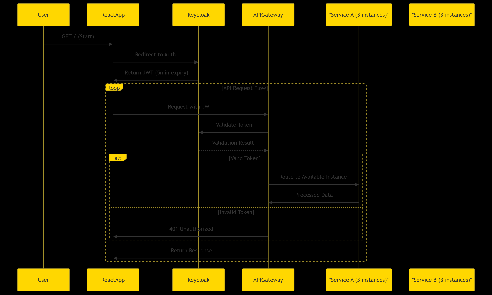

# Spring Cloud Microservices Architecture

This project demonstrates a microservices architecture using Spring Boot and Spring Cloud components, including Eureka for service discovery, Spring Cloud Gateway as the API Gateway, and multiple microservices (`service-a` and `service-b`) registered with Eureka.

## Architecture Overview

The architecture consists of the following components:

- **Eureka Server**: Acts as the service registry, allowing microservices to register and discover each other.
- **API Gateway**: Routes incoming requests to the appropriate microservices.
- **Service A & Service B**: Two microservices that provide specific functionalities.

## Project Structure

```
.
├── eureka-server/
│   └── src/
│       └── main/
│           └── java/
│               └── com/
│                   └── microservices/
│                       └── eureka_server/
├── api-gateway/
│   └── src/
│       └── main/
│           └── java/
│               └── com/
│                   └── microservices/
│                       └── api_gateway/
├── service-a/
│   └── src/
│       └── main/
│           └── java/
│               └── com/
│                   └── microservices/
│                       └── service_a/
├── service-b/
│   └── src/
│       └── main/
│           └── java/
│               └── com/
│                   └── microservices/
│                       └── service_b/
└── docker-compose.yml

```

## Prerequisites

- Docker
- Docker Compose
- Java 17
- Maven

## Setup and Run

1. **Build the JAR files**:

   Navigate to each service directory (`eureka-server`, `api-gateway`, `service-a`, `service-b`) and run:

   ```bash
   mvn clean package -DskipTests
   ```

2. **Build Docker images**:

   In each service directory, build the Docker image:

   ```bash
   docker build -t <image-name> .
   ```

3. **Start the services using Docker Compose**:

   In the root directory, run:

   ```bash
   docker-compose up --build
   ```

   This will start all services and expose the following ports:

   - Eureka Server: `http://localhost:8761`
   - API Gateway: `http://localhost:8080`
   - Service A: `http://localhost:8081`
   - Service B: `http://localhost:8082`

## Accessing the Services

- **Eureka Dashboard**: [http://localhost:8761](http://localhost:8761)
- **API Gateway**:

  - Service A: [http://localhost:8080/service-a/welcome](http://localhost:8080/service-a/welcome)
  - Service B: [http://localhost:8080/service-b/welcome](http://localhost:8080/service-b/welcome)

## Architectural Diagram

Below is a visual representation of the architecture:




## Notes

- The `api-gateway` routes requests to `service-a` and `service-b` based on the path.
- Eureka Server is configured to not register itself (`register-with-eureka: false`) and not fetch the registry (`fetch-registry: false`).
- Each service is configured to register with Eureka using a dynamic instance ID and metadata.

---
